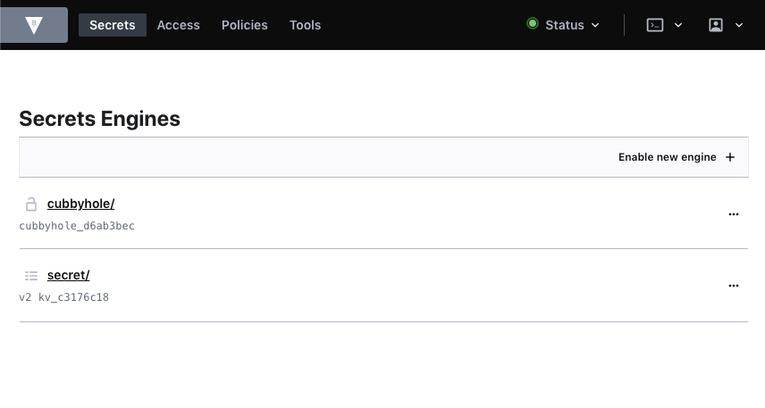
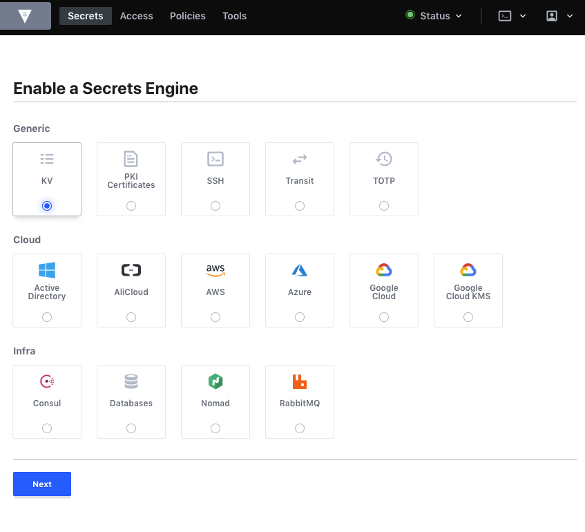
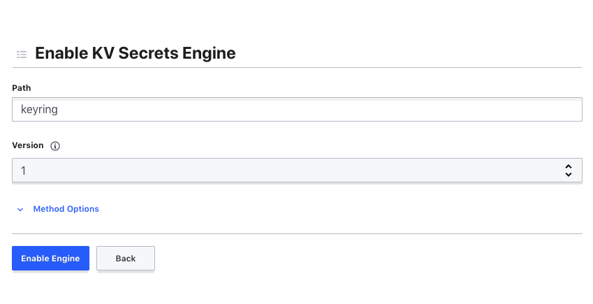
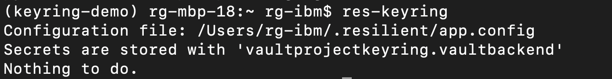

# Dockerized-Circuits-with-HashiCorpVault

## Intro
This repository is a guide on how you can use Hashicorp Vault to provide credentials to resilient_circuits using the keyring python package. 
The guide focuses on putting all of the above into a container meaning it can be built once and deployed multiple times. 

Contributions welcome from others.

When deploying Integration servers with resilient-circuits. There exists a need to encrypt credentials needed by our integrations so that there is no sensitive credentials left in plain text on the Integration Server. Keyring is what we use to provide this functionality but depending on the platform you use, you might find yourself without a default backend to depend on or alternatively you may want a more secure backend than what is offered. Here is a resource from the IBM knowledge centre giving a little more info on [using encrypted keys](https://www.ibm.com/support/knowledgecenter/en/SSBRUQ_34.0.0/com.ibm.resilient.doc/integrations/keyring.htm)


The following guide steps you through creating a docker based integration server with the keyring library to encrypt credentials. Afterwards we look at utilizing Hashicorp Vault as a backend secrets engine for keyring. The overall solution aims to solve these issues :

+ app.config values needing to be encrypted for data privacy
+ A master keyring password being requested from stdin on startup (certain linux platforms)
+ A keyring backend which can be used on any platform that python uses - some OS platforms will have a default keyring, some will not. Ideally we shoud leverage a one-for-all backend 

## Craig Roberts & Ryan Gordon

## Table of Contents 

  - [Docker Integration Image setup](#docker-integration-image-setup)
  - [Test run with keyring in the container](#test-run-with-keyring-in-the-container)
  - [Hashicorp Vault setup](#hashicorp-vault-setup)
  - [Vault as a Docker container](#vault-as-a-docker-container)
  - [Creating a secrets engine for Keyring](#creating-a-secrets-engine-for-keyring)
  - [Appendices](#appendices)


### Docker Integration Image setup 

There are a couple ways we can setup the integration server image. The easiest way involves choosing a base image, installing the needed packages and then starting resilient-circuits. Here is a minimal Dockerfile which should help you get started:

```
FROM python:3.6-alpine

RUN pip install resilient resilient-circuits keyring

# Mount /app at runtime  
ENV APP_CONFIG_FILE /app/config/app.config

WORKDIR /app

# Start resilient-circuits
CMD ["resilient-circuits", "run"] 
```

For this techincal reference we used this [internal repo to build](https://github.ibm.com/Resilient/res-circuits-docker) an integration server image which is based on the Universal Base Image. Here is some [further reading on UBI](https://www.redhat.com/en/blog/introducing-red-hat-universal-base-image). 

### Test run with keyring in the container

Before we setup all the Vault things, lets see what happens if we try to use the image as-is. Try to run your docker container ensuring that at least one of your app.config values has the keyring syntax like this:
 `password=^nameofkeyringvalue`

And then try to run the container. Depending on what base image you selected you might see either : 
+ Keyring trying to use a default backend (if one exists)
+ Keyring requesting a master password from the commandline 
+ An EOFError. This occurs when keyring tries to request the master password from the command line and your container has no access to Stdin. We see this scenario when using the UBI image.

After this, lets try to set up Vault and hook it up to resilient_circuits to avoid the 3 scenarios above.

### Hashicorp Vault setup

Now that we have the Resilient Circuits framework containerized, we need to put some work into setting up a secrets engine and configuring circuits to use it so that we can avoid the issue of being requested for a master password OR just getting a EOFError because stdin isin't available.

One solution offered for such a task is [Vault by Hashicorp](link-to-vault).

In a nutshell, vault can be used to create a key-value secrets engine which we will then use as a keyring backend.
A python package is needed to make Vault compatible with our keyring package and can be found [here](https://pypi.org/project/keyring-vault-backend/).

The above package encapsulates the API calls needed to authenticate to and use Vault within a keyring backend class. In addition to installing the package, depending on your environment you may need to add some paths to the keyring config file. 
To edit the keyring config file, locate the `keyringrc.cfg` file which is normally at this path on UNIX `~/.local/share/python_keyring/keyringrc.cfg`.
If you cannot find the keyring config file in this location, provided the python package is installed, you can find the location with this command `python -c "import keyring.util.platform_; print(keyring.util.platform_.config_root())"`

When editing the keyring config file, in order to make hashicorp vault the default keyring backend to use add this :

```
[backend]
default-keyring=vaultprojectkeyring.VaultProjectKeyring
```

>Note: You may have some issues with keyring locating the `vaultprojectkeyring` keyring module. In this case, you must also specify a `path` aswell as a `default-keyring` which will point in the direction of where the package is installed. 

### Vault as a Docker container
For testing this solution, one easy way to set up Vault is [using a Docker container](https://hub.docker.com/_/vault). Using the link provided, you will have a dev instance of Vault ready to go with a root token. 

After you start up the docker container. Try using `res-keyring` to set a value. It won't be successful and the reason is we still need to set up a secrets engine which will be used by keyring. 

Note: If you choose to use the Vault docker container for testing, evaluate whether you can use something other than root token when going to production. Root tokens should be used for testing only. 

### Creating a secrets engine for Keyring
After setting up Vault either as a Docker container or a separate deployment, we need to create a secrets engine which will store the secrets we use with keyring. 
Navigate to your Vault instance, login and you should be directed to the secrets engine page. 



From this page, select the `Enable New Engine` option which will present you with all the available Secrets Engines you can use:



The one we are looking for is the `KV` Engine which is found in the Generic list of engines. After selecting this and pressing next, we will be asked for a `Path` and a `Version`. The `Path` value must be set to `keyring` as this is where the `keyring-vault-backend` package searches for secrets. The package was originally developed against Version 1 of the Vault API and so during setup, select Version 1 from the dropdown. 

Before confirming you should have something similar to this : 



At this point if you need, you can select `Method Options` to customize different details about the engine and then to finish, select `Enable Engine`.

Once this is all setup, lets test it works by entering `res-keyring` in our terminal. 
If you don't yet have any defined keyring vars in your app.config, you should see something like the image below 



Finally we can test setting a keyring value by editing the app.config and replacing something like the `password` in the `resilient` section with a value that starts with the `^` char. Something like `^keyringpass`.

Save the changes and run `res-keyring` again. This time it should prompt you to set the password for `^keyringpass` and also to confirm it. 

Now when starting circuits, the value for `^keyringpass` will be gathered through the `keyring` package; which uses the `keyring-vault-backend` package as a backend and this will get the secret through a series of API calls to Vault.


## Appendices 

If you chose to run Vault as a Docker container, your Resilient Circuits container will need a way to 'talk' to it. There are a few ways to enable this, I added `--net="host"` to my `docker run` command which sorted the issue.

If you chose to use the Vault docker container and it ran in dev mode (the default option), the secrets are stored in memory and if you stop the container you will lose the secrets and the keyring engine. If your implementation stops working, first check Vault to ensure this hasn't happened. This is a non-issue with a production instance.